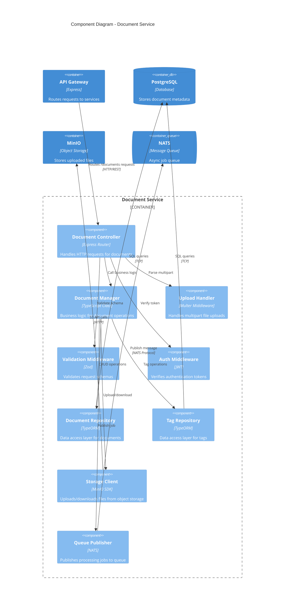
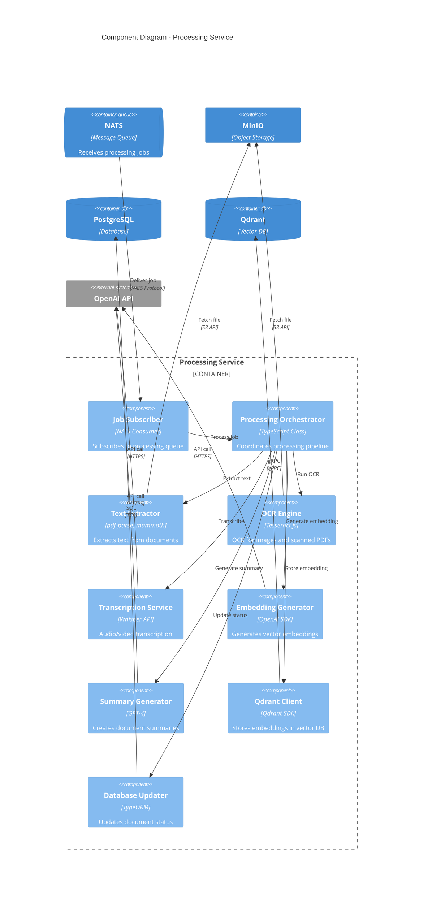

# C4 Model: Component Diagram

## Overview

The Component diagram zooms into the Document Service container to show its internal components and their interactions.

## Document Service Components



## Component Descriptions

### Document Controller
**Responsibility**: HTTP request handling for document endpoints

**Endpoints**:
- `POST /documents/upload` - Upload new document
- `GET /documents` - List documents with pagination
- `GET /documents/:id` - Get single document
- `PATCH /documents/:id` - Update document metadata
- `DELETE /documents/:id` - Soft delete document
- `GET /documents/queue/status` - Get processing queue status

**Code Structure**:
```typescript
class DocumentController {
  async upload(req: Request, res: Response): Promise<void>
  async list(req: Request, res: Response): Promise<void>
  async getById(req: Request, res: Response): Promise<void>
  async update(req: Request, res: Response): Promise<void>
  async delete(req: Request, res: Response): Promise<void>
}
```

### Document Manager
**Responsibility**: Business logic for document operations

**Key Methods**:
```typescript
class DocumentManager {
  async createDocument(userId: string, file: File, metadata: Metadata): Promise<Document>
  async listDocuments(userId: string, filters: Filters, pagination: Pagination): Promise<DocumentList>
  async getDocumentById(documentId: string, userId: string): Promise<Document>
  async updateDocument(documentId: string, updates: Partial<Document>): Promise<Document>
  async deleteDocument(documentId: string, userId: string): Promise<void>
  async checkStorageQuota(userId: string, fileSize: number): Promise<boolean>
}
```

**Business Rules**:
- Enforce storage quotas (5GB free, 100GB pro)
- Validate file types and sizes (max 10GB)
- Auto-generate titles from filenames
- Create processing jobs for async workflows

### Upload Handler
**Responsibility**: Multipart file upload processing

**Technology**: Multer middleware

**Configuration**:
```typescript
const upload = multer({
  storage: multer.memoryStorage(),
  limits: {
    fileSize: 10 * 1024 * 1024 * 1024, // 10GB
  },
  fileFilter: (req, file, cb) => {
    const allowedMimeTypes = [
      'application/pdf',
      'application/vnd.openxmlformats-officedocument.wordprocessingml.document',
      'text/plain',
      'image/png',
      'image/jpeg',
      // ... more types
    ];
    if (allowedMimeTypes.includes(file.mimetype)) {
      cb(null, true);
    } else {
      cb(new Error('Invalid file type'));
    }
  },
});
```

### Validation Middleware
**Responsibility**: Request schema validation

**Technology**: Zod for runtime type checking

**Schemas**:
```typescript
const documentListQuerySchema = z.object({
  page: z.number().min(1).default(1),
  limit: z.number().min(1).max(100).default(20),
  status: z.enum(['uploading', 'processing', 'completed', 'failed']).optional(),
  fileType: z.enum(['pdf', 'docx', 'txt', 'md', 'image', 'video', 'audio', 'other']).optional(),
  sortBy: z.enum(['createdAt', 'updatedAt', 'title', 'fileSize']).default('createdAt'),
  sortOrder: z.enum(['asc', 'desc']).default('desc'),
});

const documentUpdateSchema = z.object({
  title: z.string().min(1).max(500).optional(),
  tags: z.array(z.string()).optional(),
});
```

### Auth Middleware
**Responsibility**: JWT token verification

**Flow**:
```typescript
async function authenticate(req: Request, res: Response, next: NextFunction) {
  const token = req.headers.authorization?.replace('Bearer ', '');
  if (!token) {
    return res.status(401).json({ error: 'Unauthorized' });
  }

  try {
    const decoded = jwt.verify(token, JWT_SECRET);
    req.user = decoded; // Attach user to request
    next();
  } catch (error) {
    return res.status(401).json({ error: 'Invalid token' });
  }
}
```

### Document Repository
**Responsibility**: Data access layer for documents table

**Technology**: TypeORM

**Key Methods**:
```typescript
class DocumentRepository extends Repository<Document> {
  async findByUserId(userId: string, filters: Filters): Promise<Document[]>
  async findById(id: string): Promise<Document | null>
  async create(data: CreateDocumentDto): Promise<Document>
  async update(id: string, updates: UpdateDocumentDto): Promise<Document>
  async softDelete(id: string): Promise<void>
  async countByUserId(userId: string): Promise<number>
}
```

### Tag Repository
**Responsibility**: Data access layer for tags table

**Key Methods**:
```typescript
class TagRepository extends Repository<Tag> {
  async findOrCreate(userId: string, tagName: string): Promise<Tag>
  async attachToDocument(documentId: string, tagIds: string[]): Promise<void>
  async getPopularTags(userId: string, limit: number): Promise<Tag[]>
}
```

### Storage Client
**Responsibility**: Object storage operations

**Technology**: MinIO SDK (S3-compatible)

**Key Methods**:
```typescript
class StorageClient {
  async uploadFile(bucket: string, key: string, file: Buffer): Promise<string>
  async downloadFile(bucket: string, key: string): Promise<Buffer>
  async deleteFile(bucket: string, key: string): Promise<void>
  async getFileUrl(bucket: string, key: string, expiresIn: number): Promise<string>
  async listFiles(bucket: string, prefix: string): Promise<string[]>
}
```

**File Naming Convention**:
```
uploads/{userId}/{documentId}/{originalFilename}
processed/{userId}/{documentId}/extracted.txt
processed/{userId}/{documentId}/thumbnail.jpg
```

### Queue Publisher
**Responsibility**: Publish async processing jobs

**Technology**: NATS

**Message Structure**:
```typescript
interface ProcessingJob {
  jobId: string;
  documentId: string;
  userId: string;
  filePath: string;
  fileType: string;
  priority: 'high' | 'normal' | 'low';
  metadata: {
    language?: string;
    ocrRequired: boolean;
    generateSummary: boolean;
  };
}
```

**Queues**:
- `document.processing` - Main processing queue
- `embedding.generation` - Vector embedding generation
- `notification.email` - Email notifications

## Processing Service Components



## Processing Pipeline

### 1. Text Extraction
```typescript
class TextExtractor {
  async extractFromPDF(filePath: string): Promise<string>
  async extractFromDOCX(filePath: string): Promise<string>
  async extractFromTXT(filePath: string): Promise<string>
  async extractFromMarkdown(filePath: string): Promise<string>
}
```

**Supported Formats**:
- PDF: pdf-parse library
- DOCX: mammoth library
- TXT/MD: fs.readFile

### 2. OCR Engine
```typescript
class OCREngine {
  async recognizeText(imagePath: string, language: string): Promise<OCRResult>
  async detectTables(imagePath: string): Promise<Table[]>
  async getConfidenceScore(): Promise<number>
}
```

**Technology**: Tesseract.js (58+ languages)

### 3. Embedding Generation
```typescript
class EmbeddingGenerator {
  async generateEmbedding(text: string): Promise<number[]>
  async generateEmbeddingBatch(texts: string[]): Promise<number[][]>
}
```

**Models**:
- OpenAI: text-embedding-ada-002 (1536 dimensions)
- Local: all-MiniLM-L6-v2 (384 dimensions)

### 4. Summary Generation
```typescript
class SummaryGenerator {
  async generateSummary(
    text: string,
    options: {
      length: 'short' | 'medium' | 'detailed';
      format: 'bullets' | 'paragraph';
    }
  ): Promise<string>
}
```

## Error Handling

### Retry Strategy
```typescript
async function processWithRetry(job: ProcessingJob, maxRetries: number = 3) {
  for (let attempt = 1; attempt <= maxRetries; attempt++) {
    try {
      await processDocument(job);
      return;
    } catch (error) {
      if (attempt === maxRetries) {
        await markAsFailed(job.documentId, error.message);
        throw error;
      }
      await sleep(Math.pow(2, attempt) * 1000); // Exponential backoff
    }
  }
}
```

### Dead Letter Queue
- Failed jobs after max retries → `document.failed` queue
- Admin can manually retry or debug
- Automatic cleanup after 7 days

## Performance Optimization

### 1. Chunking for Large Documents
```typescript
async function processLargeDocument(documentId: string, filePath: string) {
  const chunkSize = 1000; // 1000 words per chunk
  const chunks = await splitIntoChunks(filePath, chunkSize);

  for (const [index, chunk] of chunks.entries()) {
    const embedding = await generateEmbedding(chunk);
    await qdrant.upsert({
      collectionName: 'document_chunks',
      points: [{
        id: `${documentId}_chunk_${index}`,
        vector: embedding,
        payload: { documentId, chunkIndex: index, text: chunk }
      }]
    });
  }
}
```

### 2. Parallel Processing
```typescript
async function processDocument(job: ProcessingJob) {
  const [text, summary, embedding] = await Promise.all([
    extractText(job.filePath),
    generateSummary(job.filePath),
    generateEmbedding(job.filePath),
  ]);

  await Promise.all([
    updateDatabase({ text, summary }),
    storeEmbedding(embedding),
  ]);
}
```

### 3. Caching
- Cache OpenAI API responses for duplicate content
- TTL: 30 days
- Key: SHA256 hash of input text

## Next Steps

- See [Deployment Diagram](./c4-deployment.md) for infrastructure
- See [Sequence Diagrams](./sequence-diagrams.md) for interaction flows
- See [API Documentation](../api/openapi.yaml) for endpoint specs
