# C4 Model: Container Diagram

## Overview

The Container diagram shows the high-level shape of the software architecture and how responsibilities are distributed across containers (applications, data stores, etc.).

## Diagram

```mermaid
C4Container
    title Container Diagram - AI Knowledge Management System

    Person(user, "User", "Researcher, Student, or Knowledge Worker")

    System_Boundary(ai_system, "AI Knowledge Management System") {
        Container(web_app, "Web Application", "React, Next.js 14", "Provides web UI for document management, search, and AI features")
        Container(desktop_app, "Desktop Application", "Tauri, React", "Native desktop app for Windows, macOS, Linux")
        Container(mobile_app, "Mobile Application", "React Native", "iOS and Android apps")

        Container(api_gateway, "API Gateway", "Node.js, Express", "Handles authentication, routing, rate limiting")
        Container(auth_service, "Auth Service", "Node.js, TypeORM", "User authentication and authorization with JWT")
        Container(document_service, "Document Service", "Node.js, TypeORM", "Document CRUD operations and metadata management")
        Container(search_service, "Search Service", "Node.js", "Hybrid search combining full-text and semantic")
        Container(processing_service, "Processing Service", "Node.js", "Document processing, OCR, text extraction, embedding generation")

        ContainerDb(postgres, "PostgreSQL", "PostgreSQL 15 + pgvector", "Stores users, documents, tags, relationships")
        ContainerDb(qdrant, "Vector Database", "Qdrant", "Stores document embeddings for semantic search")
        ContainerDb(neo4j, "Graph Database", "Neo4j", "Stores knowledge graph and relationships")
        ContainerDb(redis, "Cache", "Redis", "Session cache, search results, rate limiting")
        ContainerQueue(queue, "Message Queue", "NATS", "Async document processing jobs")
        Container(minio, "Object Storage", "MinIO", "Stores uploaded documents and processed files")
    }

    System_Ext(openai, "OpenAI API", "Embeddings and LLM")
    System_Ext(anthropic, "Anthropic API", "Claude models")

    Rel(user, web_app, "Uses", "HTTPS")
    Rel(user, desktop_app, "Uses", "Native")
    Rel(user, mobile_app, "Uses", "Native")

    Rel(web_app, api_gateway, "API calls", "HTTPS/REST")
    Rel(desktop_app, api_gateway, "API calls", "HTTPS/REST")
    Rel(mobile_app, api_gateway, "API calls", "HTTPS/REST")

    Rel(api_gateway, auth_service, "Authenticate", "gRPC")
    Rel(api_gateway, document_service, "Document ops", "gRPC")
    Rel(api_gateway, search_service, "Search queries", "gRPC")

    Rel(document_service, postgres, "Read/Write", "TCP/SQL")
    Rel(document_service, minio, "Store files", "S3 API")
    Rel(document_service, queue, "Publish jobs", "NATS")
    Rel(document_service, redis, "Cache", "Redis Protocol")

    Rel(processing_service, queue, "Subscribe to jobs", "NATS")
    Rel(processing_service, minio, "Fetch files", "S3 API")
    Rel(processing_service, postgres, "Update status", "TCP/SQL")
    Rel(processing_service, qdrant, "Store embeddings", "HTTP/gRPC")
    Rel(processing_service, openai, "Generate embeddings", "HTTPS/REST")
    Rel(processing_service, anthropic, "Transform content", "HTTPS/REST")

    Rel(search_service, postgres, "Full-text search", "TCP/SQL")
    Rel(search_service, qdrant, "Semantic search", "HTTP/gRPC")
    Rel(search_service, neo4j, "Graph queries", "Bolt")
    Rel(search_service, redis, "Cache results", "Redis Protocol")
    Rel(search_service, openai, "Query embeddings", "HTTPS/REST")

    Rel(auth_service, postgres, "User CRUD", "TCP/SQL")
    Rel(auth_service, redis, "Session cache", "Redis Protocol")

    UpdateLayoutConfig($c4ShapeInRow="3", $c4BoundaryInRow="1")
```



## Container Descriptions

### Frontend Applications

#### 1. Web Application
- **Technology**: React 19.2, Next.js 14, TypeScript
- **Purpose**: Progressive Web App for browser access
- **Features**:
  - Server-side rendering for SEO
  - Offline mode with Service Workers
  - Responsive design (desktop, tablet, mobile)
  - Real-time updates via WebSocket
- **Deployment**: Vercel, Netlify, or self-hosted

#### 2. Desktop Application
- **Technology**: Tauri 2, React, Rust
- **Purpose**: Native desktop app for Windows, macOS, Linux
- **Features**:
  - 50MB bundle size (10x smaller than Electron)
  - System tray integration
  - Offline-first operation
  - Auto-updates without admin rights
- **Deployment**: GitHub Releases, app stores

#### 3. Mobile Application
- **Technology**: React Native, TypeScript
- **Purpose**: Native mobile apps for iOS and Android
- **Features**:
  - Camera scanning for documents
  - Offline mode with local storage
  - Background sync
  - Push notifications
- **Deployment**: App Store, Google Play

### Backend Services

#### 4. API Gateway
- **Technology**: Node.js 20, Express, TypeScript
- **Purpose**: Single entry point for all API requests
- **Responsibilities**:
  - Request routing to microservices
  - Authentication verification (JWT)
  - Rate limiting (Redis-based)
  - CORS handling
  - Request/response logging
- **Port**: 8080
- **Endpoints**: `/api/v1/*`

#### 5. Auth Service
- **Technology**: Node.js 20, TypeORM, bcrypt
- **Purpose**: User authentication and authorization
- **Responsibilities**:
  - User registration and login
  - JWT token generation and validation
  - Password hashing (bcrypt)
  - OAuth integration (Google, GitHub, Microsoft)
  - Session management
- **Database**: PostgreSQL (users table)
- **Cache**: Redis (sessions, tokens)

#### 6. Document Service
- **Technology**: Node.js 20, TypeORM, Multer
- **Purpose**: Document metadata management
- **Responsibilities**:
  - Document CRUD operations
  - File upload handling (multipart/form-data)
  - Metadata extraction
  - Tag management
  - Workspace and sharing permissions
- **Database**: PostgreSQL (documents, tags tables)
- **Storage**: MinIO (uploaded files)

#### 7. Search Service
- **Technology**: Node.js 20, pg-promise
- **Purpose**: Hybrid search combining full-text and semantic
- **Responsibilities**:
  - Full-text search using PostgreSQL tsvector
  - Semantic search using Qdrant vector DB
  - Hybrid ranking (BM25 + HNSW)
  - Search suggestions and autocomplete
  - Knowledge graph queries (Neo4j)
- **Databases**: PostgreSQL, Qdrant, Neo4j
- **Cache**: Redis (search results)

#### 8. Processing Service
- **Technology**: Node.js 20, Bull Queue, Tesseract.js
- **Purpose**: Asynchronous document processing
- **Responsibilities**:
  - PDF text extraction (pdf-parse)
  - DOCX parsing (mammoth)
  - OCR for images (Tesseract)
  - Audio/video transcription (Whisper API)
  - Embedding generation (OpenAI/Anthropic)
  - Summary generation
  - Multi-level content transformation
- **Queue**: NATS (job queue)
- **Storage**: MinIO (fetch/store files)
- **External APIs**: OpenAI, Anthropic, YouTube

### Data Stores

#### 9. PostgreSQL Database
- **Version**: 15+ with pgvector extension
- **Purpose**: Primary relational database
- **Schema**:
  - Users, workspaces, workspace_members
  - Documents, tags, document_tags
  - Notes, transformations
  - Search history, activity log
- **Indexes**:
  - Full-text search (GIN tsvector)
  - Vector similarity (HNSW)
  - B-tree indexes on foreign keys
- **Backup**: Daily automated backups with 30-day retention

#### 10. Qdrant Vector Database
- **Purpose**: High-performance vector similarity search
- **Collections**:
  - `documents` (384-dim embeddings from all-MiniLM-L6-v2)
  - `notes` (384-dim embeddings)
  - `chunks` (document chunks for long documents)
- **Index**: HNSW (Hierarchical Navigable Small World)
- **Performance**: <100ms for 1M vectors
- **Replication**: 3x replication for high availability

#### 11. Neo4j Graph Database
- **Purpose**: Knowledge graph and relationships
- **Schema**:
  - Nodes: Document, Note, Tag, Concept
  - Relationships: CITES, RELATED_TO, CONTRADICTS, TAGGED_WITH
- **Queries**: Cypher query language
- **Use cases**:
  - Find related documents
  - Citation networks
  - Concept exploration

#### 12. Redis Cache
- **Purpose**: In-memory cache for performance
- **Use cases**:
  - Session storage (JWT tokens)
  - Search result caching (TTL: 5 minutes)
  - Rate limiting counters
  - Real-time queue status
- **Persistence**: AOF (Append-Only File) for durability

#### 13. NATS Message Queue
- **Purpose**: Asynchronous job processing
- **Queues**:
  - `document.processing` (text extraction, OCR)
  - `embedding.generation` (vector embeddings)
  - `notification.email` (email notifications)
- **Features**:
  - At-least-once delivery
  - Dead letter queue for failed jobs
  - Job priorities and delays

#### 14. MinIO Object Storage
- **Purpose**: S3-compatible object storage
- **Buckets**:
  - `uploads` (original uploaded files)
  - `processed` (extracted text, thumbnails)
  - `backups` (database backups)
- **Features**:
  - Versioning enabled
  - Lifecycle policies (archive old files)
  - Encryption at rest (AES-256)

## Communication Patterns

### Synchronous (REST/gRPC)
- User requests → API Gateway → Services
- API Gateway uses gRPC for internal service communication
- External APIs (OpenAI, Anthropic) via HTTPS/REST

### Asynchronous (Message Queue)
- Document upload → Queue → Processing Service
- Processing Service publishes events (processing.completed)
- Email Service subscribes to events for notifications

### Caching Strategy
1. **Cache-Aside**: Check Redis → if miss, query DB → store in Redis
2. **TTL**: Search results (5 min), user sessions (24 hours)
3. **Invalidation**: On document update/delete, invalidate related caches

## Scalability

### Horizontal Scaling
- API Gateway: Stateless, scale to N instances behind load balancer
- Document/Search Services: Stateless, auto-scale based on CPU/memory
- Processing Service: Worker pool, scale based on queue depth

### Vertical Scaling
- PostgreSQL: Read replicas for heavy read workloads
- Qdrant: Sharding by user/tenant
- Redis: Cluster mode for >10GB cache

## Security

### Authentication Flow
```
1. User → API Gateway: POST /auth/login {email, password}
2. API Gateway → Auth Service: Verify credentials
3. Auth Service → PostgreSQL: Query users table
4. Auth Service → API Gateway: JWT token (24h expiry)
5. API Gateway → User: {token, user}
```

### Authorized Request Flow
```
1. User → API Gateway: GET /documents (Authorization: Bearer <token>)
2. API Gateway → Auth Service: Validate token
3. Auth Service → Redis: Check token blacklist
4. API Gateway → Document Service: Fetch documents (userId from token)
5. Document Service → PostgreSQL: Query documents WHERE user_id = ?
6. Document Service → API Gateway: Documents array
7. API Gateway → User: Documents JSON
```

## Data Flow Example: Document Upload

```
1. User uploads PDF via Web App
2. Web App → API Gateway: POST /documents/upload (multipart/form-data)
3. API Gateway → Document Service: Store metadata
4. Document Service → PostgreSQL: INSERT INTO documents (status='uploading')
5. Document Service → MinIO: Store PDF in 'uploads' bucket
6. Document Service → NATS: Publish {documentId, filePath} to 'document.processing' queue
7. Document Service → User: {documentId, status: 'processing'}
8. Processing Service subscribes to queue
9. Processing Service → MinIO: Fetch PDF
10. Processing Service: Extract text, run OCR if needed
11. Processing Service → OpenAI API: Generate embedding
12. Processing Service → Qdrant: Store embedding
13. Processing Service → PostgreSQL: UPDATE documents SET status='completed', content=?
14. Processing Service → NATS: Publish 'processing.completed' event
15. Email Service → User: "Your document is ready" email
```

## Technology Choices Rationale

| Component | Technology | Why? |
|-----------|------------|------|
| API Gateway | Node.js/Express | Excellent async I/O, large ecosystem, easy to scale |
| Backend Services | Node.js/TypeScript | Type safety, shared types with frontend, fast development |
| Vector DB | Qdrant | Rust-based (fast), open-source, easy self-hosting |
| Relational DB | PostgreSQL | ACID compliance, pgvector extension, mature ecosystem |
| Graph DB | Neo4j | Best-in-class Cypher query language, graph algorithms |
| Cache | Redis | Industry standard, fast, rich data structures |
| Queue | NATS | Lightweight, high throughput, simple deployment |
| Storage | MinIO | S3-compatible, self-hostable, open-source |
| Desktop | Tauri | 10x smaller than Electron, Rust security, native performance |
| Mobile | React Native | Code sharing with web, large community, mature |

## Next Steps

- See [Component Diagram](./c4-component.md) for detailed service architecture
- See [Deployment Diagram](./c4-deployment.md) for infrastructure setup
- See [Database ER Diagrams](./database-er-diagrams.md) for schema details
