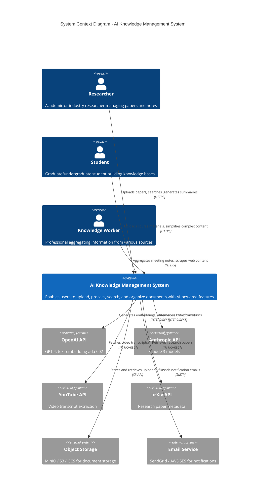

# C4 Model: System Context Diagram

## Overview

The System Context diagram provides a high-level view of the AI Knowledge Management System and its interactions with users and external systems.

## Diagram



## Actors

### Primary Users

1. **Researcher**
   - Academic and industry researchers
   - Manages 50+ research papers per month
   - Needs privacy for unpublished research
   - Uses: PDF upload, citation extraction, knowledge graphs

2. **Student**
   - Graduate and undergraduate students
   - Consumes content from multiple sources (videos, articles, textbooks)
   - Needs simplified explanations of complex topics
   - Uses: YouTube transcript extraction, multi-level understanding

3. **Knowledge Worker**
   - Product managers, analysts, professionals
   - Aggregates information from meetings, emails, documents
   - Requires self-hosted deployment for compliance
   - Uses: Meeting transcription, web scraping, team collaboration

### External Systems

1. **OpenAI API**
   - **Purpose**: Text embeddings (text-embedding-ada-002), GPT-4 for transformations
   - **Integration**: REST API with API key authentication
   - **Fallback**: Anthropic API or local models

2. **Anthropic API**
   - **Purpose**: Claude 3 models for alternative LLM provider
   - **Integration**: REST API with API key authentication
   - **Use cases**: High-quality summarization, complex reasoning

3. **YouTube API**
   - **Purpose**: Extract video transcripts and metadata
   - **Integration**: YouTube Data API v3
   - **Rate limits**: 10,000 quota units/day

4. **arXiv API**
   - **Purpose**: Fetch research papers and metadata
   - **Integration**: arXiv REST API
   - **Use cases**: Automatic citation extraction, related papers

5. **Object Storage (MinIO/S3/GCS)**
   - **Purpose**: Store uploaded documents and processed files
   - **Integration**: S3-compatible API
   - **Features**: Versioning, lifecycle policies, encryption

6. **Email Service (SendGrid/AWS SES)**
   - **Purpose**: Send transactional emails (verification, notifications)
   - **Integration**: SMTP or REST API
   - **Use cases**: Document processing completion, error alerts

## Key Interactions

### Document Upload Flow
```
User → AI Knowledge System (Upload PDF)
AI Knowledge System → Object Storage (Store file)
AI Knowledge System → OpenAI API (Generate embeddings)
AI Knowledge System → User (Processing complete notification)
```

### Search Flow
```
User → AI Knowledge System (Search query)
AI Knowledge System → OpenAI API (Generate query embedding)
AI Knowledge System → Qdrant (Vector search)
AI Knowledge System → PostgreSQL (Full-text search)
AI Knowledge System → User (Hybrid search results)
```

### Content Transformation Flow
```
User → AI Knowledge System (Simplify document to grade 8 level)
AI Knowledge System → OpenAI/Anthropic API (Transform content)
AI Knowledge System → User (Simplified version with readability score)
```

## System Boundaries

### Included in System
- Document upload and processing
- Vector and full-text search
- AI-powered transformations and summaries
- Knowledge graph management
- User authentication and authorization
- Workspace and team collaboration
- REST API and web/desktop/mobile UIs

### External Dependencies
- LLM providers (OpenAI, Anthropic)
- Content sources (YouTube, arXiv, web)
- Object storage (MinIO, S3, GCS)
- Email delivery services

## Deployment Models

1. **Cloud SaaS**
   - Multi-tenant architecture
   - Managed infrastructure
   - Automatic scaling and updates

2. **Self-Hosted**
   - Docker Compose or Kubernetes
   - On-premises or private cloud
   - Full data ownership and control

3. **Hybrid**
   - Local processing with cloud LLM APIs
   - Data stays on-premises
   - AI features via external APIs

## Security Considerations

- **Authentication**: JWT tokens with 24-hour expiration
- **Authorization**: Role-based access control (RBAC)
- **Data Encryption**: TLS 1.3 in transit, AES-256 at rest
- **API Security**: Rate limiting, API key rotation
- **Privacy**: Local-first architecture option, GDPR compliance

## Next Steps

- See [Container Diagram](./c4-container.md) for internal system structure
- See [Component Diagram](./c4-component.md) for detailed component architecture
- See [Deployment Diagram](./c4-deployment.md) for infrastructure details
