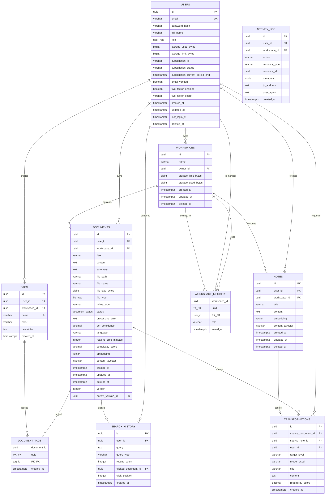
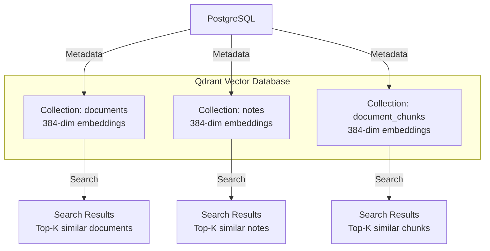
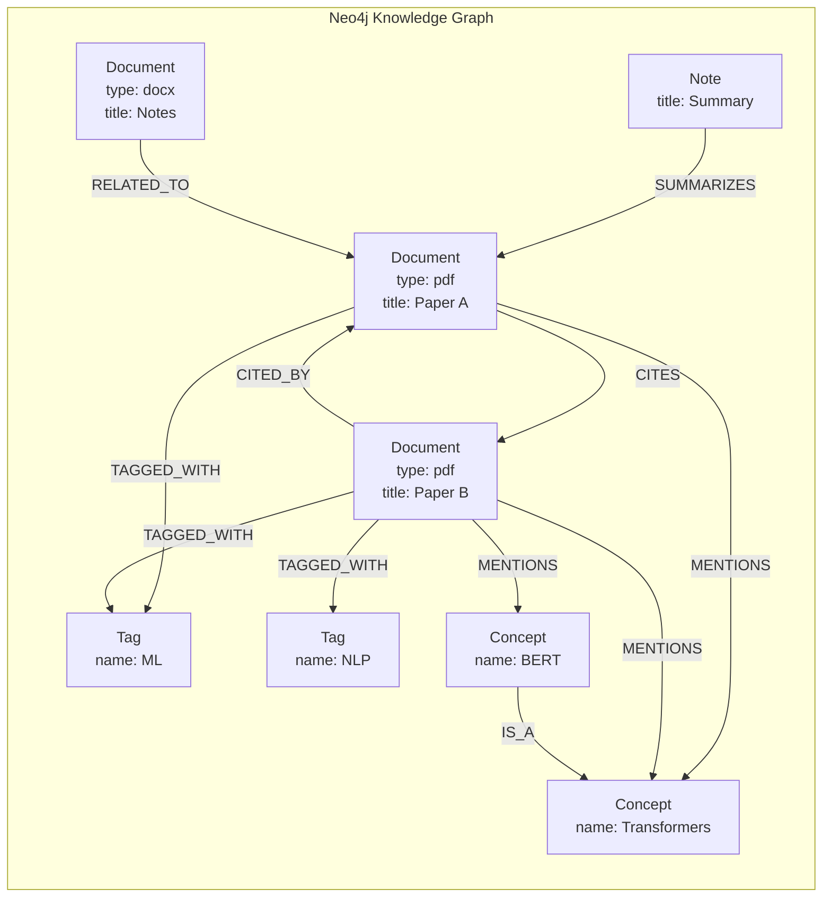

# Database ER Diagrams

## Overview

The AI Knowledge Management System uses three databases:
1. **PostgreSQL** - Relational database for structured data
2. **Qdrant** - Vector database for semantic search
3. **Neo4j** - Graph database for knowledge graphs

## PostgreSQL Entity-Relationship Diagram



## PostgreSQL Schema Details

### Core Tables

#### 1. users
**Purpose**: Store user accounts and subscription information

**Key Columns**:
- `email`: Unique user email (indexed)
- `password_hash`: Bcrypt hashed password
- `role`: Enum (free, pro, team_member, team_admin, enterprise)
- `storage_used_bytes` / `storage_limit_bytes`: Storage quota tracking
- `subscription_id`: Stripe subscription reference

**Indexes**:
- `idx_users_email` (UNIQUE) - Login lookup
- `idx_users_role` - Filter by role
- `idx_users_created_at` - Sort by registration date

**Triggers**:
- `update_users_updated_at` - Auto-update timestamp

#### 2. documents
**Purpose**: Store document metadata and content

**Key Columns**:
- `content`: Markdown extracted from document
- `summary`: AI-generated summary
- `file_path`: MinIO object path
- `status`: Enum (uploading, processing, completed, failed)
- `embedding`: Vector (384 dimensions) for semantic search
- `content_tsvector`: Full-text search vector (auto-generated)

**Indexes**:
- `idx_documents_user` - Filter by user
- `idx_documents_content_search` (GIN) - Full-text search
- `idx_documents_embedding` (HNSW) - Vector similarity search

**Constraints**:
- Foreign key to `users.id` with CASCADE delete
- Foreign key to `workspaces.id` with CASCADE delete

#### 3. tags
**Purpose**: User-defined tags for organizing documents

**Unique Constraint**: `(user_id, workspace_id, name)` - No duplicate tags per user/workspace

**Color Coding**: Hex color for UI display (#6366f1 default)

#### 4. transformations
**Purpose**: Store AI-generated content at different complexity levels

**Target Levels**:
- `kid` - 5-year-old level
- `student` - High school level
- `undergrad` - College level
- `grad` - Graduate level
- `expert` / `phd` - Expert level

**Check Constraint**: Either `source_document_id` OR `source_note_id` must be set (not both)

### Supporting Tables

#### 5. workspaces
**Purpose**: Team collaboration spaces

**Features**:
- Shared storage quota
- Multiple members with roles
- Cascade delete on owner removal

#### 6. workspace_members
**Purpose**: Many-to-many relationship between users and workspaces

**Roles**:
- `owner` - Full control
- `admin` - Manage members and settings
- `member` - Read/write access
- `viewer` - Read-only access

#### 7. search_history
**Purpose**: Track search queries for analytics and personalization

**Use Cases**:
- Search suggestions (autocomplete)
- Popular queries analytics
- Click-through rate tracking

#### 8. activity_log
**Purpose**: Audit trail for compliance

**Metadata** (JSONB):
```json
{
  "ip_address": "192.168.1.1",
  "user_agent": "Mozilla/5.0...",
  "changes": {"field": "title", "old": "Old Title", "new": "New Title"},
  "duration_ms": 1234
}
```

## Qdrant Vector Database Schema



### Collection: documents

**Purpose**: Store document-level embeddings for semantic search

**Schema**:
```json
{
  "id": "uuid",
  "vector": [0.123, -0.456, ...],  // 384 dimensions
  "payload": {
    "documentId": "uuid",
    "userId": "uuid",
    "title": "Document Title",
    "fileType": "pdf",
    "createdAt": "2025-11-28T10:30:00Z",
    "tags": ["tag1", "tag2"]
  }
}
```

**Index**: HNSW (Hierarchical Navigable Small World)
- `m`: 16 (number of bi-directional links per element)
- `ef_construction`: 64 (size of dynamic candidate list)

**Distance Metric**: Cosine similarity

### Collection: document_chunks

**Purpose**: Store chunk-level embeddings for long documents

**Why Chunking?**
- Documents >10,000 words split into 1000-word chunks
- Better precision for long-form content
- Lower embedding cost (process in batches)

**Schema**:
```json
{
  "id": "uuid_chunk_0",
  "vector": [0.123, -0.456, ...],
  "payload": {
    "documentId": "uuid",
    "chunkIndex": 0,
    "text": "Chunk content here...",
    "startPosition": 0,
    "endPosition": 1000
  }
}
```

### Collection: notes

**Purpose**: Store note-level embeddings

**Schema**: Similar to documents collection

## Neo4j Graph Database Schema



### Node Types

#### 1. Document Node
```cypher
CREATE (d:Document {
  id: 'uuid',
  title: 'Document Title',
  type: 'pdf',
  createdAt: datetime(),
  userId: 'uuid'
})
```

**Properties**:
- `id`: UUID from PostgreSQL
- `title`: Document title
- `type`: File type (pdf, docx, etc.)
- `createdAt`: Creation timestamp
- `userId`: Owner UUID

#### 2. Tag Node
```cypher
CREATE (t:Tag {
  id: 'uuid',
  name: 'machine-learning',
  color: '#6366f1'
})
```

#### 3. Concept Node
```cypher
CREATE (c:Concept {
  id: 'uuid',
  name: 'Transformers',
  definition: 'A type of neural network architecture...',
  occurrences: 42
})
```

**Auto-extracted**: Using NLP from document content

#### 4. Note Node
```cypher
CREATE (n:Note {
  id: 'uuid',
  title: 'My Summary',
  createdAt: datetime()
})
```

### Relationship Types

#### 1. CITES
**Direction**: Document → Document

**Properties**:
```cypher
CREATE (d1:Document)-[:CITES {
  citationType: 'reference',
  pageNumber: 5,
  confidence: 0.95
}]->(d2:Document)
```

**Use Case**: Citation networks, find related papers

#### 2. TAGGED_WITH
**Direction**: Document → Tag

```cypher
CREATE (d:Document)-[:TAGGED_WITH]->(t:Tag)
```

#### 3. MENTIONS
**Direction**: Document → Concept

**Properties**:
```cypher
CREATE (d:Document)-[:MENTIONS {
  frequency: 12,
  firstMentionPage: 3
}]->(c:Concept)
```

#### 4. RELATED_TO
**Direction**: Document ↔ Document

**Properties**:
```cypher
CREATE (d1:Document)-[:RELATED_TO {
  similarity: 0.85,
  reason: 'shared concepts',
  confidence: 0.92
}]->(d2:Document)
```

**Auto-generated**: Based on semantic similarity

#### 5. IS_A (Concept Hierarchy)
**Direction**: Concept → Concept

```cypher
CREATE (c1:Concept {name: 'BERT'})-[:IS_A]->(c2:Concept {name: 'Transformer'})
```

### Example Queries

#### Find all documents citing a specific paper:
```cypher
MATCH (source:Document)-[:CITES]->(target:Document {id: 'uuid'})
RETURN source
```

#### Find related documents based on shared concepts:
```cypher
MATCH (d1:Document {id: 'uuid'})-[:MENTIONS]->(c:Concept)<-[:MENTIONS]-(d2:Document)
WHERE d1 <> d2
RETURN d2, COUNT(c) AS sharedConcepts
ORDER BY sharedConcepts DESC
LIMIT 10
```

#### Find documents by tag hierarchy:
```cypher
MATCH (d:Document)-[:TAGGED_WITH]->(t:Tag)
WHERE t.name IN ['machine-learning', 'deep-learning', 'neural-networks']
RETURN d
```

#### Citation network visualization:
```cypher
MATCH path = (d1:Document)-[:CITES*1..3]-(d2:Document)
WHERE d1.id = 'uuid'
RETURN path
```

## Data Synchronization

### PostgreSQL → Qdrant
**Trigger**: After document processing completes

**Flow**:
```
1. Processing Service generates embedding
2. Store in Qdrant collection
3. Update PostgreSQL documents.embedding column (optional backup)
4. Both DBs now have same embedding
```

### PostgreSQL → Neo4j
**Trigger**: After document created/updated

**Flow**:
```
1. Document created in PostgreSQL
2. Event published to NATS (document.created)
3. Graph Service subscribes to event
4. Create Document node in Neo4j
5. Extract concepts and create MENTIONS relationships
6. Create TAGGED_WITH relationships
```

### Consistency Strategy
- **PostgreSQL**: Source of truth for all data
- **Qdrant**: Derived data (can be rebuilt from PostgreSQL)
- **Neo4j**: Derived data (can be rebuilt from PostgreSQL)

### Rebuild Process
If Qdrant or Neo4j data is lost:

```typescript
async function rebuildVectorDB() {
  const documents = await postgres.query('SELECT * FROM documents WHERE embedding IS NOT NULL');

  for (const doc of documents) {
    await qdrant.upsert({
      collection: 'documents',
      points: [{
        id: doc.id,
        vector: doc.embedding,
        payload: {
          documentId: doc.id,
          userId: doc.user_id,
          title: doc.title
        }
      }]
    });
  }
}

async function rebuildKnowledgeGraph() {
  const documents = await postgres.query('SELECT * FROM documents');

  for (const doc of documents) {
    // Create Document node
    await neo4j.run(`
      CREATE (d:Document {
        id: $id,
        title: $title,
        type: $type
      })
    `, { id: doc.id, title: doc.title, type: doc.file_type });

    // Create Tag relationships
    const tags = await postgres.query('SELECT * FROM document_tags WHERE document_id = $1', [doc.id]);
    for (const tag of tags) {
      await neo4j.run(`
        MATCH (d:Document {id: $docId}), (t:Tag {id: $tagId})
        CREATE (d)-[:TAGGED_WITH]->(t)
      `, { docId: doc.id, tagId: tag.tag_id });
    }
  }
}
```

## Database Sizing

### PostgreSQL

**Estimated Row Counts** (100K users, avg 100 docs/user):

| Table | Rows | Avg Row Size | Total Size |
|-------|------|--------------|------------|
| users | 100K | 500 bytes | 50 MB |
| documents | 10M | 2 KB | 20 GB |
| tags | 500K | 200 bytes | 100 MB |
| document_tags | 30M | 50 bytes | 1.5 GB |
| notes | 5M | 1 KB | 5 GB |
| transformations | 2M | 3 KB | 6 GB |
| search_history | 50M | 300 bytes | 15 GB |
| activity_log | 100M | 500 bytes | 50 GB |
| **Total** | | | **~98 GB** |

**Index Size**: ~30% of table size = 30 GB

**Total Database Size**: ~130 GB

### Qdrant

**Estimated Point Counts**:

| Collection | Points | Vector Dims | Metadata | Total Size |
|------------|--------|-------------|----------|------------|
| documents | 10M | 384 | 500 bytes | 15 GB |
| notes | 5M | 384 | 300 bytes | 8 GB |
| document_chunks | 50M | 384 | 200 bytes | 77 GB |
| **Total** | 65M | | | **100 GB** |

**HNSW Index Overhead**: ~20% = 20 GB

**Total Qdrant Size**: ~120 GB

### Neo4j

**Estimated Node/Relationship Counts**:

| Type | Count | Avg Size | Total Size |
|------|-------|----------|------------|
| Document nodes | 10M | 200 bytes | 2 GB |
| Tag nodes | 500K | 150 bytes | 75 MB |
| Concept nodes | 1M | 300 bytes | 300 MB |
| CITES relationships | 5M | 100 bytes | 500 MB |
| TAGGED_WITH relationships | 30M | 50 bytes | 1.5 GB |
| MENTIONS relationships | 50M | 100 bytes | 5 GB |
| **Total** | | | **~10 GB** |

## Next Steps

- See [Migration Guide](./migrations.md) for database setup
- See [Backup & Recovery](../operations/backup-recovery.md) for data protection
- See [Performance Tuning](../operations/performance-tuning.md) for optimization
